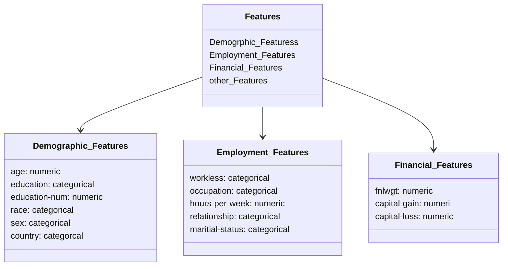

# Modular-Workflow-and-project-setup

# Problem Statement:

## Business Context:
The project aims to develop a machine learning system that predicts individual income levels based on demographics and employment data.

The Prediction boundary is set at $50,000 annually (binary classification problem).

The solution will help in understanding socio-economic factors affecting income levels.

Enable dat-driven decision making for policy makerss and financial instituations.

Identify key scio-economic factors influencing income disparities.

Support targete intervations programs for economic develoment

## Key Stakeholder

**Policy Makers:** For evidence-based policy development
**Financial Institutions:** For risk assessment and product development
**Social Services:** For resource allocation and program planning
**Research Organization:** For socio-economic studies

# Dataset Details:
Let's visualize the data structures and feature:

